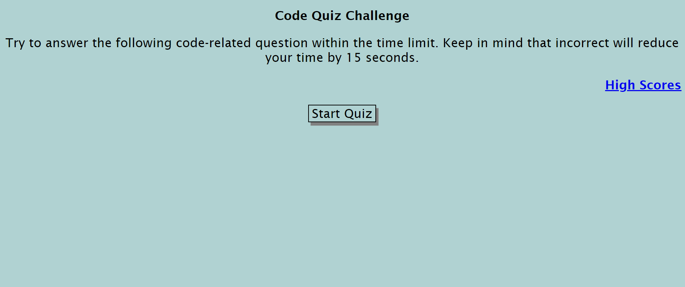

# Code Quiz

## Table of Contents  
* [Description](##Description)  
* [Installation](##Installation)  
* [License](##License)  
* [Usage](##Usage)  
* [Contact](##Contact)  

## Description

This quiz is to be used to review the in class review section for webAPIs. This is to help the user remember the questions went over in class. The application is meant to replace the flash card the creator uses to review the content. From this application, the creator learned how to attach a second page to an HTML and how to save information to the local storage.

## Installation

To use this application, please go to the following website: https://hoeferg.github.io/code-quiz/

## Usage

To start the quiz click on the start button. Try to answer the questions correctly as you go through the quiz. Each time the answer is incorrect you will lose 5 seconds. At the end of the quiz the time left is your score. You can enter your initials at the end to save your score. Then you can go to the high scores page and view all the high scores completed. 

## License

No license

## Contact
Gayle Hoefer - [LinkedIn](https://www.linkedin.com/in/gayle-hoefer-61a2a3124/) - [Github](https://github.com/hoeferg)
